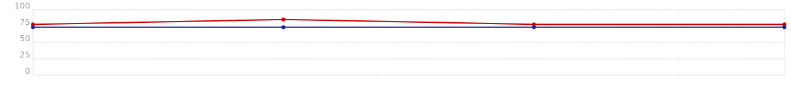

<p align="center">
    
</p>

# Sobre o restaurente

> Ctrl+Eat é mais do que uma simples restaurente fast food; é uma experiência gastronômica em constante evolução. Localizada no coração do bairro (e agora em grande expansão!), nosso restaurante combina o sabor autêntico dos clássicos do fast food com a inovação da tecnologia de autoatendimento. Aqui, os clientes podem personalizar seus pedidos, escolhendo entre uma variedade de ingredientes frescos e molhos exclusivos. Nossa equipe dedicada garante que cada pedido seja preparado com perfeição. Além disso, oferecemos um ambiente moderno e acolhedor, onde os clientes podem relaxar e desfrutar de suas refeições. Com o sistema construído exclusivamente para a Ctrl+Eat, prometemos uma experiência deliciosa, rápida e personalizada para todos os amantes de fast food. Venha saborear o futuro da alimentação rápida!

## Conteúdo

- [Event Storming](https://miro.com/app/board/uXjVMlp82Do=/?share_link_id=110707337684)
- [Dockerfile & docker-compose](./docs/features/06%20Docker/docker.md)
- [Mapa de Navegação e uso de APIs](https://miro.com/app/board/uXjVNXQyIeY=/?share_link_id=702397873101)
- [Domínios](./docs/features/00%20Domínios/dominios.md)
- [Mapa de Contexto](./docs/features/01%20Mapa%20de%20Contexto/mapa_contexto.md)
- [Funcionalidades](./docs/features/features.md)
- [Diagrama de Relacionamento de Entidades](./docs/database/database.md)

## Conatineres

Este projeto utiliza o Docker para executar os serviços necessários para a aplicação funcionar corretamente. Para facilitar a execução, foi criado um arquivo `docker-compose.yml` que contém todos os serviços necessários.

Ao executar o comando para inicializar os containeres, o Docker irá baixar as imagens necessárias e executar os seguintes containers:

- PostgreSQL (16.0)
- pgAdmin (7.8)
- Web API (.NET 7)

As URLs necessárias para acessar os serviços são:
- pgAdmin: [http://localhost:5050](http://localhost:5050) (user: `admin@admin`, password: `admin`)
- Web API: [http://localhost:5001](http://localhost:5001/swagger/index.html)

## Dependências

Para executar esta aplicação são necessárias as seguintes dependências:

- [Docker](https://docs.docker.com/engine/install/)
- [Makefile](https://linuxhint.com/install-make-ubuntu/)
- [JQ](https://jqlang.github.io/jq/)

**ATENÇÃO:**

Caso queira executar os testes automatizados ou a própria aplicação, é necessário ter o .NET 7 instalado. Para instalar visite este [link](https://learn.microsoft.com/en-us/dotnet/core/install/linux-ubuntu) e siga as instruções para instalar o dotnet.

### WSL2

Sugiro utilizar o [WSL2](https://learn.microsoft.com/pt-br/windows/wsl/install) para executar esta aplicação.

### Docker

Primeiro, atualize as dependências do sistema:
```bash
sudo apt update && sudo apt upgrade
```

Remova as versões antigas:    
```bash
sudo apt remove docker docker-engine docker.io containerd runc
```

Instale os pré-requisitos do Docker:
```bash
sudo apt-get install \
    apt-transport-https \
    ca-certificates \
    curl \
    gnupg \
    lsb-release
```

Adicione o repositório do Docker nos sources do Ubuntu:
```bash
curl -fsSL https://download.docker.com/linux/ubuntu/gpg | sudo gpg --dearmor -o /usr/share/keyrings/docker-archive-keyring.gpg
echo \
  "deb [arch=amd64 signed-by=/usr/share/keyrings/docker-archive-keyring.gpg] https://download.docker.com/linux/ubuntu \
  $(lsb_release -cs) stable" | sudo tee /etc/apt/sources.list.d/docker.list > /dev/null
```

Instale o Docker:
```bash
sudo apt-get install docker-ce docker-ce-cli containerd.io docker-buildx-plugin docker-compose-plugin
```

Dê as permissões para rodar o Docker com o usuário atual:
```bash
sudo usermod -aG docker $USER
```

Execute o Docker:
```bash
sudo service docker start
```

### Makefile

Instale o Makefile:
```bash
sudo apt install make
```

### JQ

Instale o JQ:
```bash
sudo apt install jq
```

Uma vez com todas as dependências instaladas, podemos prosseguir!

## Inicializando e executando a aplicação

1 - Inicialize os containers:
```bash
make up
```

2 - Realize o seed dos dados:
```bash
make seed-all
```

3 - Acesse a aplicação em [http://localhost:5001/swagger/index.html](http://localhost:5001/swagger/index.html)

## Executando as APIs via Postman

Caso queira executar as requisições através do Postman, basta importar o arquivo [postman.json](./docs/features/07%20Postman/postman.json).

## Executando as APIs via REST Client

É possível utilizar e testar as rotas através do Swagger, porém para facilitar, segue abaixo alguns exemplos de uso das APIs através do VS Code + REST Cliente.

Para visualizar os exemplos de uso, instale a extensão [REST Client](https://marketplace.visualstudio.com/items?itemName=humao.rest-client) no VS Code e abra o arquivo [api.http](./api/CtrlEat/src/Adapters/Driving/Web.Api/api.http) para executar as requisições.

Clique na label `Send Request` para executar a chamada da rota:


## Testes automatizados

Este projeto consta com uma gama de testes automatizados. Para executá-los é essencial ter o Docker rodando pois é utilizado a estratégia dos [Test Containers](https://dotnet.testcontainers.org/) para executar as integrações com o banco de dados PostgreSQL.

Para executar os testes via através da CLI, execute o seguinte comando:
```bash
make test
```

Ou através do Visual Studio:


## Cobertura de código

Este projeto utiliza a ferramenta [ReportGenerator](https://reportgenerator.io/) para visualizar a cobertura do código.

É necessário intalar o ReportGenerator globalmente:
```bash
dotnet tool install --global dotnet-reportgenerator-globaltool
```

Para gerar o relatório de cobertura, execute o seguinte comando:
```bash
make coverage
```

O relatório será gerado na pasta `./coveragereport` e pode ser visualizado abrindo o arquivo `./coveragereport/index.html` em seu navegador.

### Sumário de cobertura
Para visualizar o sumário completo de cobertura, acesse este [arquivo](./coveragereport/SummaryGithub.md).

### Histórico de cobertura

