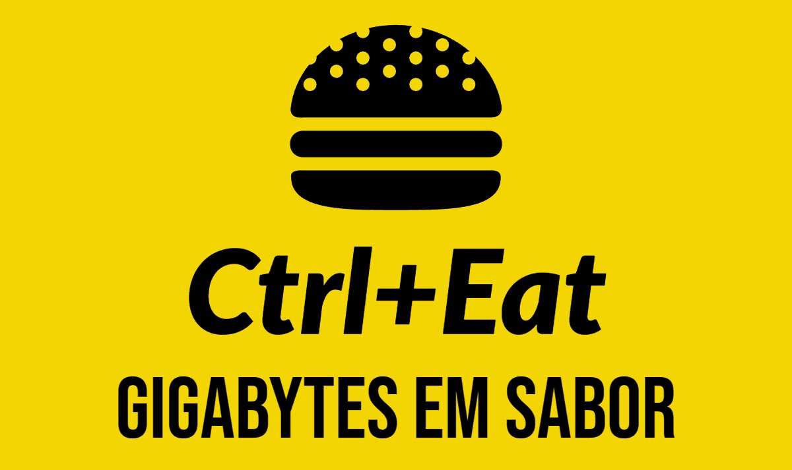

<p align="center">
    
</p>

# Sobre o restaurente

> Ctrl+Eat é mais do que uma simples restaurente fast food; é uma experiência gastronômica em constante evolução. Localizada no coração do bairro (e agora em grande expansão!), nosso restaurante combina o sabor autêntico dos clássicos do fast food com a inovação da tecnologia de autoatendimento. Aqui, os clientes podem personalizar seus pedidos, escolhendo entre uma variedade de ingredientes frescos e molhos exclusivos. Nossa equipe dedicada garante que cada pedido seja preparado com perfeição. Além disso, oferecemos um ambiente moderno e acolhedor, onde os clientes podem relaxar e desfrutar de suas refeições. Com o sistema construído exclusivamente para a Ctrl+Eat, prometemos uma experiência deliciosa, rápida e personalizada para todos os amantes de fast food. Venha saborear o futuro da alimentação rápida!

## Conteúdo

- [Event Storming](https://miro.com/app/board/uXjVMlp82Do=/?share_link_id=110707337684)
- [Domínios](./docs/features/00%20Domínios/dominios.md)
- [Mapa de Contexto](./docs/features/01%20Mapa%20de%20Contexto/mapa_contexto.md)
- [Funcionalidades](./docs/features/features.md)
- [Diagrama de Relacionamento de Entidades](./docs/database/database.md)
 
## Dependências

Para executar esta aplicação são necessárias as seguintes dependências:

- [Docker](https://docs.docker.com/engine/install/)
- [Makefile no Ubuntu](https://linuxhint.com/install-make-ubuntu/)
- [Makefile no Windows](https://linuxhint.com/run-makefile-windows/)

Uma vez instalados o docker e o makefile, podemos prosseguir!

## Executando a aplicação

1 - Inicialize os containers:
```bash
make up
```

2 - Realize o seed dos dados:
```bash
make seed-all
```

3 - Acesse a aplicação em [http://localhost:5001/swagger/index.html](http://localhost:5001/swagger/index.html)

## Exemplos de uso

Para visualizar alguns exemplos de uso, instale a extensão [REST Client](https://marketplace.visualstudio.com/items?itemName=humao.rest-client) no VS Code e abra o arquivo [api.http](./api/CtrlEat/src/Adapters/Driving/Web.Api/api.http) para executar as requisições.

Cliente na label `Send Request` para executar a chamada da rota:

