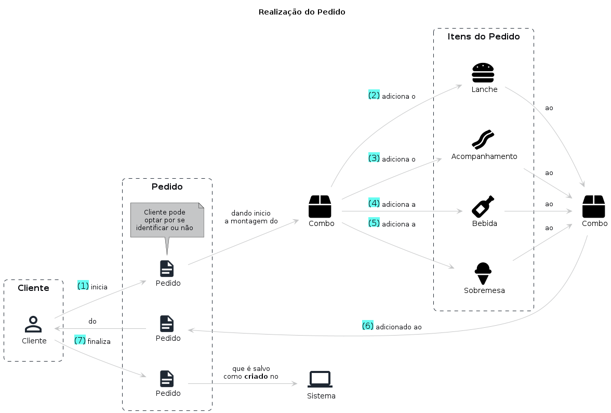

# Realização do Pedido

## Entidades

```
Cliente

> Entidade responsável por realizar os pedidos no sistema

CPF
Nome completo
E-mail
```

```
Produto

> Entidade responsável por representar um item do pedido como por exemplo o lanche ou a bebida

Nome
Descrição
Categoria
Preço unitário
Imagem
```

```
Pedido

> Entidade responsável por agrupar um conjunto de itens selecionados pelo cliente

Cliente
Status do pedido
Lista dos produtos
```

## Fluxo

1. Cliente inicia o pedido
2. Adiciona o lanche
3. Adiciona o acompanhamento
4. Adiciona a bebida
5. Adiciona a sobremesa
6. Combo adicionado ao pedido
7. Cliente finaliza o pedido que é persistido como **criado**

## Storytelling

