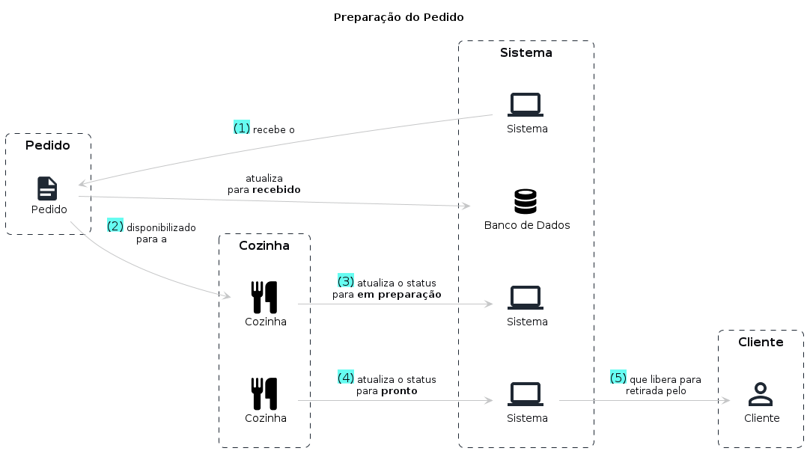

# Preparação do Pedido

## Entidades

- Cliente: Entidade responsável por realizar os pedidos no sistema podendo se identificar via CPF, realizar cadastro com nome e e-mail ou permanecer de forma anônima
- Pedido: Entidade responsável por agrupar um conjunto de itens selecionados pelo cliente
- Cozinha: Entidade responsável por realizar a preparação do pedido

## Fluxo

1. Sistema recebe um pedido **pago** e disponibiliza para a cozinha atualizando seu status como **recebido**
2. Pedido é disponibilizado para ser preparado
3. Funcionário da cozinha inicia o preparo do pedido
4. Funcionário atualiza o status do pedido para **em preparação** 
4. Funcionário atualiza o status do pedido para **pronto**
5. Sistema notifica o cliente sobre o pedido disponível para retirada

## Storytelling

