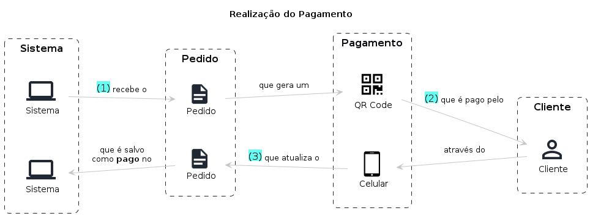

# Realização do Pagamento

## Entidades

```
Cliente

> Entidade responsável por realizar os pedidos no sistema

CPF
Nome completo
E-mail
```

```
Pedido

> Entidade responsável por agrupar um conjunto de itens selecionados pelo cliente

Cliente
Status do pedido
Lista dos produtos
```

```
Pagamento

> Entidade responsável por armazenar os dados do pedido de um determinado cliente contendo as informações sobre o status do pagamento (solicitado, pago ou rejeitado)

Pedido
Preço total
Status do pagamento
```

## Fluxo

1. Sistema recebe um pedido onde é gerado um QR Code
2. Cliente paga através do Celular
3. Pedido atualizado para **pago**

## Storytelling

