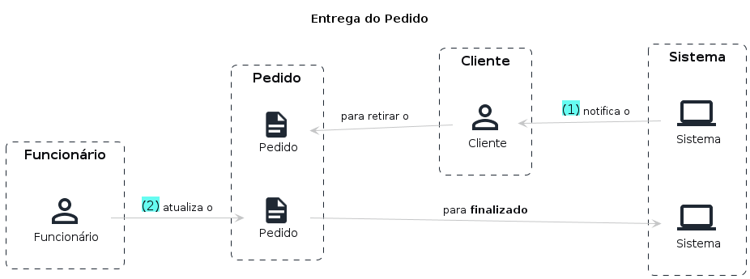

# Preparação do Pedido

## Entidades

- Cliente: Entidade responsável por realizar os pedidos no sistema podendo se identificar via CPF, realizar cadastro com nome e e-mail ou permanecer de forma anônima
- Pedido: Entidade responsável por agrupar um conjunto de itens selecionados pelo cliente

## Fluxo

1. Cliente é notificado sobre seu pedido **pronto**
2. Cliente retira o pedido com um funcionário
3. Funcionário atualiza o status do pedido para **finalizado**

## Storytelling

