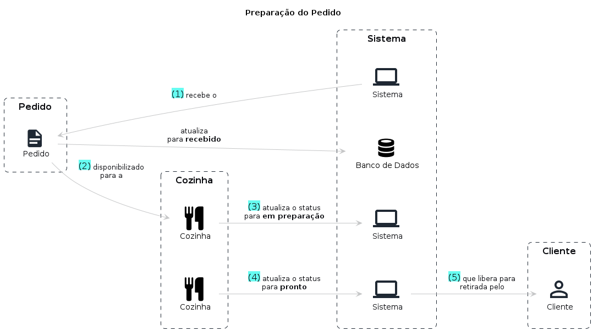

# Preparação do Pedido

## Entidades

```
Cliente

> Entidade responsável por realizar os pedidos no sistema

CPF
Nome completo
E-mail
```

```
Pedido

> Entidade responsável por agrupar um conjunto de itens selecionados pelo cliente

Cliente
Status do pedido
Lista dos produtos
```

```
Cozinha

> Entidade responsável por realizar a preparação do pedido

Pedido
Status do pedido
Tempo de preparo
```

## Fluxo

1. Sistema recebe um pedido **pago** e disponibiliza para a cozinha atualizando seu status como **recebido**
2. Pedido é disponibilizado para ser preparado
3. Funcionário da cozinha inicia o preparo do pedido
4. Funcionário atualiza o status do pedido para **em preparação** 
4. Funcionário atualiza o status do pedido para **pronto**
5. Sistema notifica o cliente sobre o pedido disponível para retirada

## Storytelling

