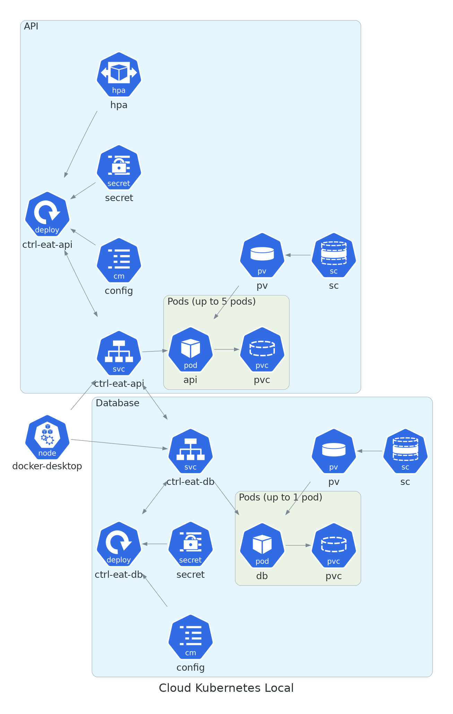
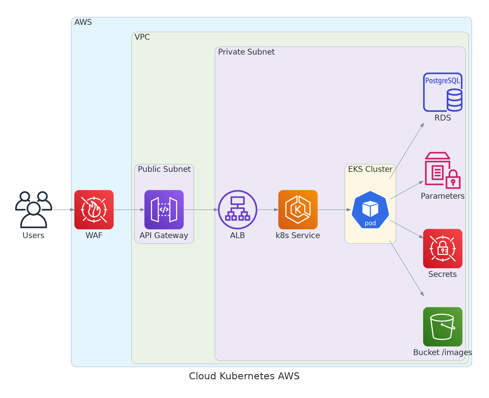

## Arquitetura

A arquitetura escolhida por pensada para ser de fácil manutenção, confiabilidade e caso necessário fácil replicação em outro provedor de nuvem. Utilizar o Kubernetes nos traz diversos benefícios, dentre eles:
- Escalabilidade
- Alta disponibilidade
- Facilidade de deploy
- Facilidade de manutenção
- Facilidade de monitoramento
- Facilidade de gerenciamento

A respeito do provedor de nuvem escolhido, a **Amazon Web Services (AWS)**, a arquitetura escolhida foi pensada para ser de fácil integração com os serviços já existente no provedor além de recursos de segurança como o **Web Application Firewall (WAF)** que é um firewall de aplicação web que ajuda a proteger as aplicações web de ataques comuns na web, como por exemplo um ataque **DDoS**.

Para armazenar as imagens dos produtos e também para compor a arquitetura de deploy do banco de dados, foi escolhido o **Simple Storage Service (S3)** que é um serviço de armazenamento de arquivos que oferece escalabilidade, disponibilidade de dados, segurança e performance.

Quando falamos de uma aplicação em nuvem a segurança vem em primeiro lugar, por isso foi escolhido o **AWS Secrets Manager** que é um serviço de gerenciamento de segredos que permite armazenar, gerenciar e recuperar, de forma segura, informações de acesso a serviços externos como por exemplo o banco de dados. Além de ser fácil utilização com as aplicações que estão rodando no Kubernetes.

Já para os dados não tão sensíveis como por exemplo as configurações de ambiente, foi escolhido o **AWS Parameter Store** que é um serviço de gerenciamento de parâmetros que permite armazenar, gerenciar e recuperar, de forma segura, informações de configuração para aplicações que não exijam um grau alto de confidencialidade.

E por fim, mas não menos importante, para o banco de dados foi escolhido o **Relational Database Service (RDS)** rodando um banco de dados **PostgreSQL** que é um serviço de banco de dados relacional que oferece escalabilidade, disponibilidade de dados, segurança e performance.

### Diagrama de Arquitetura - Local Kubernetes

### Diagrama de Arquitetura - AWS Kubernetes

### Diagrama da Database Migration - AWS

