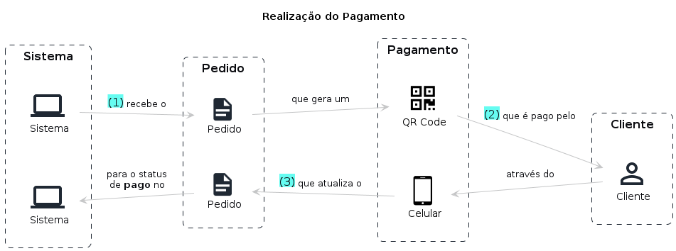

# Realização do Pedido e Pagamento

## Entidades

- Cliente: Entidade responsável por realizar os pedidos no sistema podendo se identificar via CPF, realizar cadastro com nome e e-mail ou permanecer de forma anônima
- Pedido: Entidade responsável por agrupar um conjunto de itens selecionados pelo cliente
- Pagamento: Entidade responsável por armazenar os dados do pedido de um determinado cliente contendo as informações sobre o status do pagamento (solicitado, pago ou rejeitado)

## Fluxo

1. Sistema recebe um pedido onde é gerado um QR Code
2. Cliente paga através do Celular
3. Pedido atualizado para Pago

## Storytelling

