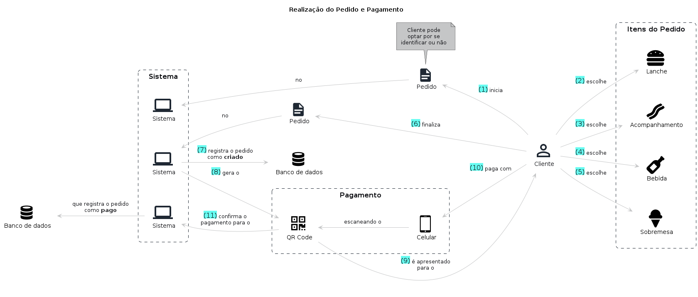

# Realização do Pedido e Pagamento

## Entidades

- Cliente: Entidade responsável por realizar os pedidos no sistema podendo se identificar via CPF, realizar cadastro com nome e e-mail ou permanecer de forma anônima
- Item: Entidade responsável por representar um item do pedido como por exemplo o lanche ou a bebida
- Pedido: Entidade responsável por agrupar um conjunto de itens selecionados pelo cliente
- Pagamento: Entidade responsável por armazenar os dados do pedido de um determinado cliente contendo as informações sobre o status do pagamento (solicitado, aceito ou rejeitado)

## Fluxo

1. Cliente inicia o pedido
2. Sistema cria e retorna um Nº de pedido
3. Cliente escolhe o lanche
4. Cliente escolhe o acompanhamento
5. Cliente escolhe a bebida
6. Cliente escolhe a sobremesa
7. Cliente finaliza o pedido
8. Sistema registra o pedido como Criado
9. Sistema gera o QRCode para o Cliente
10. Cliente realiza o pagamento com o Celular
11. Sistema registra o pedido como Realizado

## Storytelling

